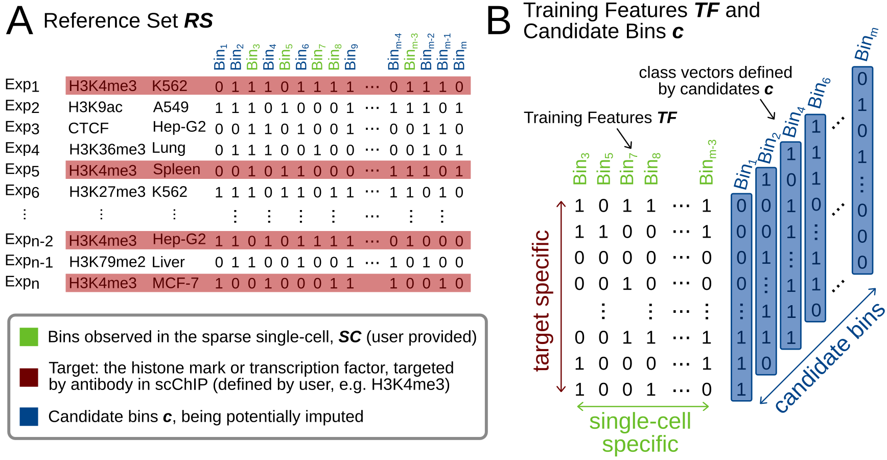

# SIMPA - Single-cell chIp-seq iMPutAtion

SIMPA is a method for single-cell ChIP-seq imputation that leverages predictive information within epigenomic data from ENCODE to impute missing protein-DNA interactions for a histone mark or transcription factor of interest. SIMPA was tested on a recent dataset (Grosselin et al. 2019) to impute missing regions in sparse data from single-cell ChIP-seq of H3K4me3 and H3K27me3 in B-cells and T-cells. Different to common single-cell imputation methods, SIMPA leverages predictive information within bulk ChIP-seq experimental data. This dataset contains > 2.200 experiments downloaded from ENCODE and available in this repository, preprocessed for SIMPA. The user provides peaks of one single cell that are used by SIMPA to impute missing interactions for the target (histone mark or transcription factor, also specified by the user) of interest while keeping cell-type specificity and the cells individuality. In our preprint on [bioRxiv](https://www.biorxiv.org/content/10.1101/2019.12.20.883983v3) we present SIMPA's capability to complete sparse single-cell input while improving cell-type clustering and recovering cell-type-specific pathways.



## Installation

SIMPA, implemented in Python, runs on a Linux operating system and was tested on:
- Ubuntu 16.04.6 LTS (Xenial Xerus)
- Ubuntu 18.04.3 LTS (Bionic Beaver)
- CentOS Linux 7 (Core)
- Debian GNU/Linux 9 (stretch)

The following installation steps may take up to 15 minutes in total.

### Installation of ANACONDA  

First, install anaconda in case you do not have it in your linux machine. We highly recommend to install the most recent one.

```
wget https://repo.anaconda.com/archive/Anaconda3-2019.10-Linux-x86_64.sh
bash Anaconda3-2019.10-Linux-x86_64.sh

```
Accept licence and installation requirements with "return" and "yes", but follow the instructions, you might like to change the directory for anaconda. After installation it is necessary to initialize conda with:
```
source ~/.bashrc
```

### Create a conda environment `simpa` with anaconda:

```
conda config --add channels defaults
conda config --add channels conda-forge
conda config --add channels bioconda
conda create -n simpa python=3.7 anaconda pandas=0.25.1 numpy=1.17.2 mpi4py=3.0.2
```
Finally activate the environment before running the algorithm:

`conda activate simpa`


## Clone repository and display command line arguments
In case `git` is not installed, you can install it via `conda` as well:

```
conda install -c anaconda git
```

Clone repository and run SIMPA to get the usage information:

```
git clone https://github.com/salbrec/SIMPA.git
cd SIMPA/

python SIMPA_1_0.py --help
```

The expected output looks like this:

```
usage: SIMPA_1_0.py [-h] --bed BED --targets TARGETS [--outdir OUTDIR]
                [--genome {hg38}] [--binsize {5kb,50kb}]
                [--estimators ESTIMATORS] [--simulate]

SIMPA - Single-cell chIp-seq iMPutAtion

optional arguments:
  -h, --help            show this help message and exit
  --bed BED, -b BED     Path to bed file with sparse single-cell input
  --targets TARGETS, -t TARGETS
                        Target(s) defining the specific reference experiments
                        (ususally the one used in the scChIP). When multiple
                        targets are provided, separate by "+"
  --outdir OUTDIR, -o OUTDIR
                        Output directory. Default: "./"
  --genome {hg38}, -g {hg38}
                        Genome assembly
  --binsize {5kb,50kb}, -bs {5kb,50kb}
                        Size of the bins (genomic regions)
  --estimators ESTIMATORS, -e ESTIMATORS
                        Number of trees in Random Forest
  --simulate            Impute only 100 bins for testing the software

```

## Running SIMPA

Applying SIMPA on a bed file that contains the sparse input (300 peaks after removing gender specific chromosomes) from an individual single cell is as simple as this:

```
python SIMPA_1_0.py -b ./scExamples/H3K4me3_hg38_5kb/BC8791969.bed -t H3K4me3 --simulate
```
The expected output looks like this:

```

Given the sparse input there are 300 genomic regions converted into 300 bins of size 5kb
Number of available bulk reference experiments: 178 (for H3K4me3)
Number of bins with a signal in at least one bulk: 314856
Number of candidate bins: 100 (simulation mode is on)
Shape of matrix for training features: (178, 300)

##### Pre-Processing is done ... #####

Training 92 models for 100 candidate bins
Random Forest is used with 100 trees
The task is shared by 1 processors

##### Writing output to "./" #####

Reference bulk experiments have in average 32584 bins
32284 bins were imputed (not really, because of "simulate")
Done!


```

Note, the optinal argument `--simulate` is used here for testnig purpose as it restricts SIMPA to train machine learning models for only 100 candidate bins. To get the full result, remove it.

### Command line arguments

Given an example from H3K27me3 in another resolution, the call could look like this, expecting the output to be stored in `/BC20160289/`.  

```
python SIMPA_1_0.py -b ./scExamples/H3K27me3_hg38_50kb/BC20160289.bed -t H3K27me3 -bs 50kb -o ./BC20160289/ --simulate
```

## SIMPA output

SIMPA creates two files reusing the filename of the given bed file as prefix. 

One in `simpa` format, a table describing one bin per line with the following columns:

- ID of the bin
- chromosome
- start 
- end
- reference frequency
- imputed probability

The bins on top of this table have no imputed probability as those are the bins observed for the given single cell. The following imputed bins are ranked by the imputed probability.

The second file is in `bed` format and describes the genomic regions for the single-cell bins followed by bins ranked by their imputed probability. The number of bins within this file is the average number of bins that SIMPA calculates based on the target-specific reference experiments used within the algorithm.

It is up to the user to create further bed-files of different sizes derived from the SIMPA table:

```
head -n <number of bins> IMPUTATION_freq_prob.simpa | awk '{print $2"\t"$3"\t"$4}' > new.bed
```

### Runtime and MPI

Due to the amount of machine learning models to be trained, SIMPA can take up to 5h for the imputation of one cell in 5kb resolution for H3K4me3. However, SIMPA is an MPI implementation that automatically distributes the computationally heavy part to multiple cores on a system providing an MPI installation. The number of cores can be defined by the user. An example `slurm` script is provided that allows to run SIMPA using many cores from several compute nodes after adapting the account, partition, and other system-specific calls like "module load". We achieved the best efficiency by using a whole node (40 cores or an Intel® Xeon® Prozessor E5-2630 v4) that imputed one single cell within 15 minutes. However, the script provided uses 4 nodes with 160 cores doing the same job in ~8 minutes.

```
sbatch slurm
```
Having an MPI installation on a Linux server or local Linux machine, SIMPA can also be used with `mpiexec`. The following call runs with 2 cores:
```
mpiexec -n 2 python SIMPA_1_0.py -b ./scExamples/H3K4me3_hg38_5kb/BC8791969.bed -t H3K4me3
```
Additional non-standard hardware for such an execution is not required.
