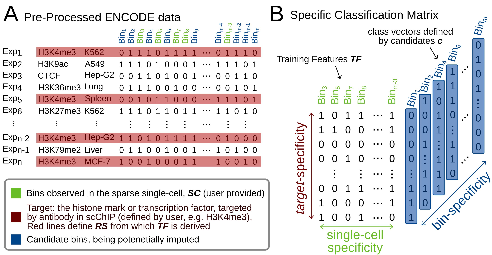

# SPARTA - SPARse peaks impuTAtion

SPARTA is a method for SPARse peaks impuTAtion that leverages predictive information within bulk ENCODE data to impute missing regions for a histone mark or transcription factor of interest. SPARTA was tested on a recent dataset (Grosselin et al. 2019) to impute DNA regions from single-cell ChIP-seq of H3K4me3 and H3K27me3 mark in B-cell and T-cell.



## Installation with ANACONDA  

Install first anaconda in case you do not have it for linux machine. In any way we highle recommend to install the most recent one.

```
wget https://repo.anaconda.com/archive/Anaconda3-2019.10-Linux-x86_64.sh
bash Anaconda3-2019.10-Linux-x86_64.sh
```

Create a conda environment `sparta` with anaconda:

```
conda config --add channels defaults
conda config --add channels conda-forge
conda config --add channels bioconda
conda create -n sparta python=3.7 anaconda mpi4py
```
Finally activate the environment before running the algorithm.

`conda activate sparta`


## Clone repository and display command line arguments

```
git clone https://github.com/salbrec/SPARTA.git
cd SPARTA/

python SPART.py --help

usage: SPARTA.py [-h] --bed BED --targets TARGETS [--outdir OUTDIR]
                 [--genome GENOME] [--binsize BINSIZE]
                 [--estimators ESTIMATORS] [--simulate]

SPARTA: SPARse peaks impuTAtion

optional arguments:
  -h, --help            show this help message and exit
  --bed BED, -b BED     Sparse single-cell input dataset path
  --targets TARGETS, -t TARGETS
                        Target(s) defining the bulk reference data (ususally
                        the on used in scChIP). When multiple targets
                        provided, separate by "+"
  --outdir OUTDIR, -o OUTDIR
                        Output directory. Default: ./
  --genome GENOME, -g GENOME
                        Genome assembly
  --binsize BINSIZE, -bs BINSIZE
                        Size of the bins (genomic regions)
  --estimators ESTIMATORS, -e ESTIMATORS
                        Number of trees in Random Forest
  --simulate            Impute only 100 bins for testing the software


```

## Running SPARTA

Applying SPARTA on a bed file that contains the sparse input from an individual single cell is as simple as this:

```
python SPARTA.py -b ./scExamples/H3K4me3_hg38_5kb/BC9244609.bed -t H3K4me3
```
In order to test whether everyhing is running smoothly you can add `--simulate` that restricts SPARTA to train machine learning models for only 100 bins.

## SPARTA used with some arguments

Given an example from H3K27me3 in another resolution, the call could look like this, expecting the output to be stored in `/BC20160289/`.

`python SPARTA.py -b ./scExamples/H3K27me3_hg38_50kb/BC20160289.bed -t H3K27me3 -bs 50kb -o ./BC20160289/`

## Runtime and MPI

Due to the amount of machine learning models to be trained, SPARTA can take up to 20h for the imputation of one cell in for example 5kb resolution for H3K4me3. Though, SPARTA is an MPI implementation that automatically distributes the computationally part to multiple cores on a system providing an Open MPI installation. An example `slurm` script is provided that allows to run SPARTA using many cores from several compute nodes after specifying the users account and the partition. 

```
sbatch slurm
```

## SPARTA output

SPARTA creates two files. On in "sparta" format, a table describing one bin per line with the following columns:
- ID of the bin
- chromosome
- start 
- end
- reference frequency
- imputed probability
The bins on the head have no imputed probability as those are the bins observed for the given single cell. Following bins are ranked by imputed probability.
Based on the average number of bins observed in the target-specific reference experiments, SPARTA creates one final imputation result in bed-format.

It is up to the user to create further bed-files of different sizes derived from the SPARTA table:

```
head -n <number of bins> IMPUTATION_freq_prob.sparta | awk '{print $2"\t"$3"\t"$4}'
```


 
