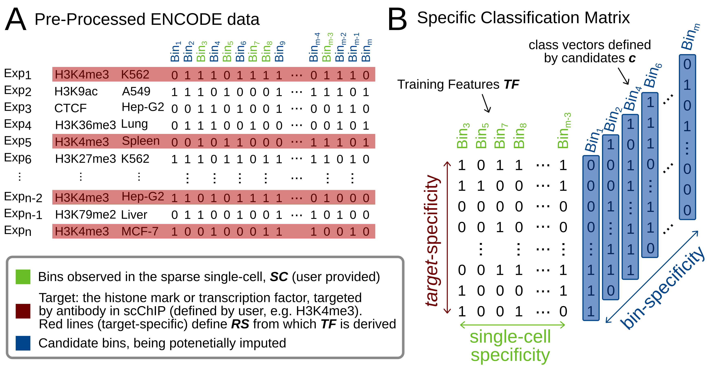

# SPARTA - SPARse peaks impuTAtion

SPARTA is a method for SPARse peaks impuTAtion that leverages predictive information within epigenomic data from ENCODE to impute missing protein-DNA interactions for a histone mark or transcription factor of interest. SPARTA was tested on a recent dataset (Grosselin et al. 2019) to impute missing regions in sparse data from single-cell ChIP-seq of H3K4me3 and H3K27me3 in B-cell and T-cell [bioRxiv](https://giphy.com/gifs/love-movie-perfect-2BG086WOP2Xfi).



## Installation with ANACONDA  

First, install anaconda in case you do not have it for linux your machine. In any way we highly recommend to install the most recent one.

```
wget https://repo.anaconda.com/archive/Anaconda3-2019.10-Linux-x86_64.sh
bash Anaconda3-2019.10-Linux-x86_64.sh

```
Accept everything with "yes". After installation it might be necessary to initialize conda with
```
source ~/.bashrc
```

### Create a conda environment `sparta` with anaconda:

```
conda config --add channels defaults
conda config --add channels conda-forge
conda config --add channels bioconda
conda create -n sparta python=3.7 anaconda mpi4py numpy
```
Finally activate the environment before running the algorithm:

`conda activate sparta`


## Clone repository and display command line arguments

```
git clone https://github.com/salbrec/SPARTA.git
cd SPARTA/

python SPARTA.py --help


usage: SPARTA.py [-h] --bed BED --targets TARGETS [--outdir OUTDIR]
                 [--genome {hg38}] [--binsize {5kb,50kb}]
                 [--estimators ESTIMATORS] [--simulate]

SPARTA: SPARse peaks impuTAtion

optional arguments:
  -h, --help            show this help message and exit
  --bed BED, -b BED     Sparse single-cell input dataset path
  --targets TARGETS, -t TARGETS
                        Target(s) defining the bulk reference data (ususally
                        the on used in scChIP). When multiple targets
                        provided, separate by "+"
  --outdir OUTDIR, -o OUTDIR
                        Output directory. Default: ./
  --genome {hg38}, -g {hg38}
                        Genome assembly
  --binsize {5kb,50kb}, -bs {5kb,50kb}
                        Size of the bins (genomic regions)
  --estimators ESTIMATORS, -e ESTIMATORS
                        Number of trees in Random Forest
  --simulate            Impute only 100 bins for testing the software


```

## Running SPARTA

Applying SPARTA on a bed file that contains the sparse input (300 peaks after removing gender specific chromosomes) from an individual single cell is as simple as this:

```
python SPARTA.py -b ./scExamples/H3K4me3_hg38_5kb/BC8791969.bed -t H3K4me3
```
In order to test whether it runs properly, you can add `--simulate` that restricts SPARTA to train machine learning models for only 100.

### Command line arguments

Given an example from H3K27me3 in another resolution, the call could look like this, expecting the output to be stored in `/BC20160289/`.

`python SPARTA.py -b ./scExamples/H3K27me3_hg38_50kb/BC20160289.bed -t H3K27me3 -bs 50kb -o ./BC20160289/`

## SPARTA output

SPARTA creates two files. 

One in `sparta` format, a table describing one bin per line with the following columns:

- ID of the bin
- chromosome
- start 
- end
- reference frequency
- imputed probability

The bins on the head of this table have no imputed probability as those are the bins observed for the given single cell. Following bins are ranked by imputed probability.

The second file is in `bed` format and describes the genomic regions for the single-cell bins followed by bins ranked by their imputed probability. The number of bins within this file is the average number of bins that SPARTA calculates based on the target-specific reference experiments used within the algorithm.

It is up to the user to create further bed-files of different sizes derived from the SPARTA table:

```
head -n <number of bins> IMPUTATION_freq_prob.sparta | awk '{print $2"\t"$3"\t"$4}' > new.bed
```

### Runtime and MPI

Due to the amount of machine learning models to be trained, SPARTA can take up to 13h for the imputation of one cell in 5kb resolution for H3K4me3. However, SPARTA is an MPI implementation that automatically distributes the computationally heavy part to multiple cores on a system providing an Open MPI installation. The number of cores can be defined by the user. An example `slurm` script is provided that allows to run SPARTA using many cores from several compute nodes after specifying the users account and the partition. We achieved the best efficiency using all 40 cores of one node (Intel® Xeon® Prozessor E5-2630 v4). Run SPARTA with 4 node, each node with 64 core, it takes ~8 minutes for a single cell.

```
sbatch slurm
```


 
